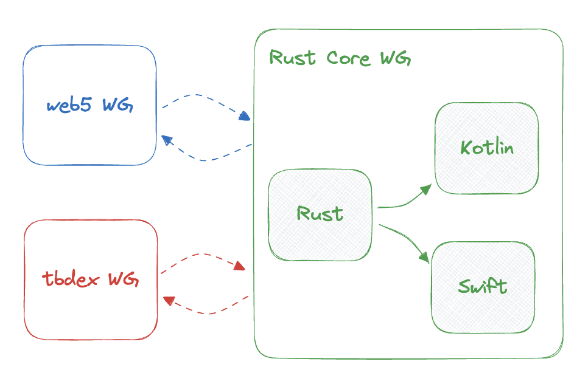
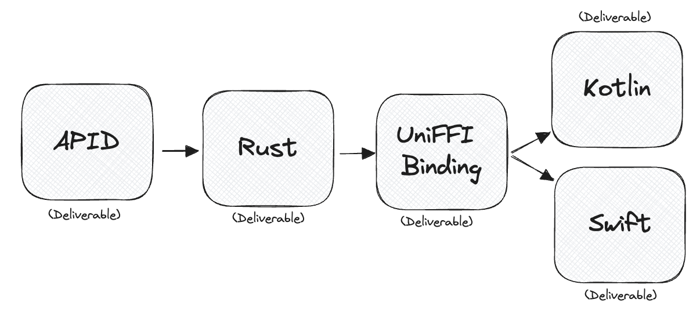

# Rust Core Working Group Charter <!-- omit in toc -->

**Start Date**: June 6th 2024

**End Date**: Unknown

**DRI**: [Kendall Weihe](https://github.com/KendallWeihe)

- [Motivation and Background](#motivation-and-background)
- [Scope](#scope)
- [Deliverables](#deliverables)
  - [Web5](#web5)
    - [\[Deliverable 1\]: Web5 API Design (APID)](#deliverable-1-web5-api-design-apid)
    - [\[Deliverable 2\]: Web5 Rust Implementation](#deliverable-2-web5-rust-implementation)
    - [\[Deliverable 3\]: Web5 UniFFI Binding](#deliverable-3-web5-uniffi-binding)
    - [\[Deliverable 4\]: Web5 Kotlin Implementation](#deliverable-4-web5-kotlin-implementation)
    - [\[Deliverable 5\]: Web5 Swift Implementation](#deliverable-5-web5-swift-implementation)
  - [tbDEX](#tbdex)
    - [\[Deliverable 6\]: tbDEX API Design (APID)](#deliverable-6-tbdex-api-design-apid)
    - [\[Deliverable 7\]: tbDEX Rust Implementation](#deliverable-7-tbdex-rust-implementation)
    - [\[Deliverable 8\]: tbDEX UniFFI Binding](#deliverable-8-tbdex-uniffi-binding)
    - [\[Deliverable 9\]: tbDEX Kotlin Implementation](#deliverable-9-tbdex-kotlin-implementation)
    - [\[Deliverable 10\]: tbDEX Swift Implementation](#deliverable-10-tbdex-swift-implementation)
- [Success Criteria](#success-criteria)
- [Coordination](#coordination)
- [Communication](#communication)

## Motivation and Background

This working group will streamline and standardize the implementations of the open standards presented by the Web5 and tbDEX Working Groups.

SDKs for Web5 and tbDEX have been implemented across TypeScript ([Web5-js](https://github.com/TBD54566975/Web5-js/) & [tbDEX-js](https://github.com/TBD54566975/tbDEX-js/)), Kotlin ([Web5-kt](https://github.com/TBD54566975/Web5-kt/) & [tbDEX-kt](https://github.com/TBD54566975/tbDEX-kt/)), Swift ([Web5-swift](https://github.com/TBD54566975/Web5-swift/) & [tbDEX-swift](https://github.com/TBD54566975/tbDEX-swift/)), Golang ([Web5-go](https://github.com/TBD54566975/Web5-go/) & [tbDEX-go](https://github.com/TBD54566975/tbDEX-go/)), and Dart ([Web5-dart](https://github.com/TBD54566975/Web5-dart/) & [tbDEX-dart](https://github.com/TBD54566975/tbDEX-dart/)). Streamlining the implementation's for Web5 and tbDEX by implementing "core" logic in Rust, and then binding the solution into the target language, offers many benefits. The benefits of Rust Core include but are not limited to:

- Strong interoperability assurances.
- Reduce maintenance burden for particularly dense feature sets (ex. did:dht).
- Serve as a Schelling Point for matters of implementation governance.
- Contain a convenient location for a historical record of decisions-made.

Rust is uniquely qualified as the solution for a cross-platform core implementation because of open source tooling availability through WASM and UniFFI. Furthermore, Rust has a broad array of open source support, and Rust has the unique feature of memory safety (relative to alternatives such as C).

## Scope

The comprehensive implementations of the Web5 and tbDEX specifications across Rust, Kotlin and Swift are within the scope of this Working Group. Alongside of each implementation, documentation comments ("doc comments"), test vectors, example usages, and CI/CD solutions (eg. security analysis, test automation, artifact version & publication, etc.) are all within scope of this Working Group. 

The Rust Core Working Group will make an intentional effort to prioritize matters of security and performance. Furthermore, with regards to API design & developer experience (DX), this Working Group will prioritize first and foremost modularity and extensibility, over DX convenience, in order to limit the liklihood of introducing breaking changes to consumers of the delivered SDKs.

The Rust Core Working Group is not concerned with the definitions of the Web5 and tbDEX specifications, both of which are the concerns of the respective Working Group. However, the Rust Core Working Group will offer valuable concrete feedback to the Web5 and tbDEX Working Groups. Although the Web5 and tbDEX specifications are not within the scope of this Working Group, a considerable amount of cross-Working Group collaboration is to be expected (see [Coordination](#coordination) and [Communication](#communication) below).

The Rust Core Working Group codifies a standard API Design ([Web5 APID](#deliverable-1-web5-api-design-apid) & [tbDEX APID](#deliverable-6-tbdex-api-design-apid)) which is implemented across all supported language implementations (Rust, Kotlin and Swift), but any additional API features or design characteristics are not within the scope of this Working Group. Each implementation must support the standard API Design as a baseline implementation, but does not exclude the possibility of additional features.

The Rust Core Working Group will codify itself across the following GitHub repos:

- Web5: https://github.com/TBD54566975/Web5-rs/
  - [[Deliverable 1]: Web5 API Design (APID)](#deliverable-1-web5-api-design-apid)
  - [[Deliverable 2]: Web5 Rust Implementation](#deliverable-2-web5-rust-implementation)
  - [[Deliverable 3]: Web5 UniFFI Binding](#deliverable-3-web5-uniffi-binding)
  - [[Deliverable 4]: Web5 Kotlin Implementation](#deliverable-4-web5-kotlin-implementation)
  - [[Deliverable 5]: Web5 Swift Implementation](#deliverable-5-web5-swift-implementation)
  - RFCs for historical tracking of significant decisions
- tbDEX: https://github.com/TBD54566975/tbDEX-rs/
  - [[Deliverable 6]: tbDEX API Design (APID)](#deliverable-6-tbdex-api-design-apid)
  - [[Deliverable 7]: tbDEX Rust Implementation](#deliverable-7-tbdex-rust-implementation)
  - [[Deliverable 8]: tbDEX UniFFI Binding](#deliverable-8-tbdex-uniffi-binding)
  - [[Deliverable 9]: tbDEX Kotlin Implementation](#deliverable-9-tbdex-kotlin-implementation)
  - [[Deliverable 10]: tbDEX Swift Implementation](#deliverable-10-tbdex-swift-implementation)
  - RFCs for historical tracking of significant decisions

## Deliverables

### Web5

#### [Deliverable 1]: Web5 API Design (APID)

**Description**: The *Web5 APID* is a language-independent codified API Design which serves to act as a baseline of features for implementations. The APID is primarily considered to be a deliverable for internal usage, but does not exclude the possibility of external consumption.

**DRI**: [Kendall Weihe](https://github.com/KendallWeihe).

**Scope of Work**:

- Custom DSL which is conceptually compatible with all target languages.
- Codification of the API Design using the Custom DSL.
- Example usages.
- Doc comments for the API Design.
- Test vector resources.

**Timeline/Milestones**: Unknown???

**Exit Criteria**: Comprehensive feature coverage for the Web5 specification, codified in the Custom DSL, committed to source code.

#### [Deliverable 2]: Web5 Rust Implementation

**Description**: Rust implementation of the [[Deliverable 1]: Web5 API Design (APID)](#deliverable-1-web5-api-design-apid), intended for public consumption.

**DRI**: [Kendall Weihe](https://github.com/KendallWeihe).

**Scope of Work**:

- Full conformance to [[Deliverable 1]: Web5 API Design (APID)](#deliverable-1-web5-api-design-apid).
- Comprehensive integration of test vectors (from APID).
- Comprehensive documentation comments (from APID).
- CI/CD implementations for security analysis, test automation, and crate publication.

**Timeline/Milestones**: ???

**Exit Criteria**: Full implementation of *Scope of Work* as a Rust project.

#### [Deliverable 3]: Web5 UniFFI Binding

**Description**: Rust crate which utilizes [UniFFI](https://github.com/mozilla/uniffi-rs) in conjunction with the [[Deliverable 2]: Web5 Rust Implementation](#deliverable-2-web5-rust-implementation) to create Kotlin and Swift binded code, which feed into [[Deliverable 4]: Web5 Kotlin Implementation](#deliverable-4-web5-kotlin-implementation) and [[Deliverable 5]: Web5 Swift Implementation](#deliverable-5-web5-swift-implementation). This deliverable is intended primarily for internal purposes but does not exclude the possibility of public consumption.

**DRI**: [Kendall Weihe](https://github.com/KendallWeihe).

**Scope of Work**:

- UDL file with comprehensive feature coverage from [[Deliverable 2]: Web5 Rust Implementation](#deliverable-2-web5-rust-implementation).
- Successful binding executions for Kotlin & Swift.

**Timeline/Milestones**: ???

**Exit Criteria**: Successful binding executions, over the comprehensive set of features from [[Deliverable 2]: Web5 Rust Implementation](#deliverable-2-web5-rust-implementation), for Kotlin and Swift.

#### [Deliverable 4]: Web5 Kotlin Implementation

**Description**: Kotlin implementation of Web5 by wrapping [[Deliverable 3]: Web5 UniFFI Binding](#deliverable-3-web5-uniffi-binding) as to be conformant to the [[Deliverable 1]: Web5 API Design (APID)](#deliverable-1-web5-api-design-apid), intended for public consumption.

**DRI**: [Neal Roessler](https://github.com/nitro-neal).

**Scope of Work**:

- Utilization of the output of the [[Deliverable 3]: Web5 UniFFI Binding](#deliverable-3-web5-uniffi-binding).
- Full conformance to [[Deliverable 1]: Web5 API Design (APID)](#deliverable-1-web5-api-design-apid).
- Comprehensive integration of test vectors (from APID).
- Comprehensive documentation comments (from APID).
- CI/CD implementations for security analysis, test automation, and crate publication.

**Timeline/Milestones**: ???

**Exit Criteria**: Full implementation of *Scope of Work* as a Kotlin project.

#### [Deliverable 5]: Web5 Swift Implementation

**Description**: Swift implementation of Web5 by wrapping [[Deliverable 3]: Web5 UniFFI Binding](#deliverable-3-web5-uniffi-binding) as to be conformant to the [[Deliverable 1]: Web5 API Design (APID)](#deliverable-1-web5-api-design-apid), intended for public consumption.

**DRI**: [Kirah Sapong](https://github.com/kirahsapong).

**Scope of Work**:

- Utilization of the output of the [[Deliverable 3]: Web5 UniFFI Binding](#deliverable-3-web5-uniffi-binding).
- Full conformance to [[Deliverable 1]: Web5 API Design (APID)](#deliverable-1-web5-api-design-apid).
- Comprehensive integration of test vectors (from APID).
- Comprehensive documentation comments (from APID).
- CI/CD implementations for security analysis, test automation, and crate publication.

**Timeline/Milestones**: ???

**Exit Criteria**: Full implementation of *Scope of Work* as a Swift project.

### tbDEX

#### [Deliverable 6]: tbDEX API Design (APID)

**Description**: The *tbDEX APID* is a language-independent codified API Design which serves to act as a baseline of features for implementations. The APID is primarily considered to be a deliverable for internal usage, but does not exclude the possibility of external consumption.

**DRI**: [Kendall Weihe](https://github.com/KendallWeihe)

**Scope of Work**:

- Custom DSL which is conceptually compatible with all target languages.
- Codification of the API Design using the Custom DSL.
- Example usages.
- Doc comments for the API Design.
- Test vector resources.

**Timeline/Milestones**: Unknown???

**Exit Criteria**: Comprehensive feature coverage for the tbDEX specification, codified in the Custom DSL, committed to source code.

#### [Deliverable 7]: tbDEX Rust Implementation

**Description**: Rust implementation of the [[Deliverable 6]: tbDEX API Design (APID)](#deliverable-6-tbdex-api-design-apid), intended for public consumption.

**DRI**: [Diane Huxley](https://github.com/diehuxx).

**Scope of Work**:

- Full conformance to [[Deliverable 6]: tbDEX API Design (APID)](#deliverable-6-tbdex-api-design-apid).
- Comprehensive integration of test vectors (from APID).
- Comprehensive documentation comments (from APID).
- CI/CD implementations for security analysis, test automation, and crate publication.

**Timeline/Milestones**: ???

**Exit Criteria**: Full implementation of *Scope of Work* as a Rust project.

#### [Deliverable 8]: tbDEX UniFFI Binding

**Description**: Rust crate which utilizes [UniFFI](https://github.com/mozilla/uniffi-rs) in conjunction with the [[Deliverable 7]: tbDEX Rust Implementation](#deliverable-7-tbdex-rust-implementation) to create Kotlin and Swift binded code, which feed into [[Deliverable 9]: tbDEX Kotlin Implementation](#deliverable-9-tbdex-kotlin-implementation) and [[Deliverable 10]: tbDEX Swift Implementation](#deliverable-10-tbdex-swift-implementation). This deliverable is intended primarily for internal purposes but does not exclude the possibility of public consumption.

**DRI**: [Kendall Weihe](https://github.com/KendallWeihe).

**Scope of Work**:

- UDL file with comprehensive feature coverage from [[Deliverable 7]: tbDEX Rust Implementation](#deliverable-7-tbdex-rust-implementation).
- Successful binding executions for Kotlin & Swift.

**Timeline/Milestones**: ???

**Exit Criteria**: Successful binding executions, over the comprehensive set of features from [[Deliverable 7]: tbDEX Rust Implementation](#deliverable-7-tbdex-rust-implementation), for Kotlin and Swift.

#### [Deliverable 9]: tbDEX Kotlin Implementation

**Description**: Kotlin implementation of tbDEX by wrapping [[Deliverable 8]: tbDEX UniFFI Binding](#deliverable-8-tbdex-uniffi-binding) as to be conformant to the [[Deliverable 6]: tbDEX API Design (APID)](#deliverable-6-tbdex-api-design-apid), intended for public consumption.

**DRI**: [Neal Roessler](https://github.com/nitro-neal).

**Scope of Work**:

- Utilization of the output of the [[Deliverable 8]: tbDEX UniFFI Binding](#deliverable-8-tbdex-uniffi-binding).
- Full conformance to [[Deliverable 6]: tbDEX API Design (APID)](#deliverable-6-tbdex-api-design-apid).
- Comprehensive integration of test vectors (from APID).
- Comprehensive documentation comments (from APID).
- CI/CD implementations for security analysis, test automation, and crate publication.

**Timeline/Milestones**: ???

**Exit Criteria**: Full implementation of *Scope of Work* as a Kotlin project.

#### [Deliverable 10]: tbDEX Swift Implementation

**Description**: Swift implementation of tbDEX by wrapping [[Deliverable 8]: tbDEX UniFFI Binding](#deliverable-8-tbdex-uniffi-binding) as to be conformant to the [[Deliverable 6]: tbDEX API Design (APID)](#deliverable-6-tbdex-api-design-apid), intended for public consumption.

**DRI**: [Kirah Sapong](https://github.com/kirahsapong).

**Scope of Work**:

- Utilization of the output of the [[Deliverable 8]: tbDEX UniFFI Binding](#deliverable-8-tbdex-uniffi-binding).
- Full conformance to [[Deliverable 6]: tbDEX API Design (APID)](#deliverable-6-tbdex-api-design-apid).
- Comprehensive integration of test vectors (from APID).
- Comprehensive documentation comments (from APID).
- CI/CD implementations for security analysis, test automation, and crate publication.

**Timeline/Milestones**: ???

**Exit Criteria**: Full implementation of *Scope of Work* as a Swift project.

## Success Criteria

The Rust Core Working Group will have achieved its objective if it delivers comprehensive implementations for the Web5 and tbDEX specifications, across Rust, Kotlin and Swift, as robust, extensible, performant, and secure artifacts for public consumption in highly available and reliable production environments.

## Coordination

The Rust Core Working Group will need to coordinate regularly with the Web5 and tbDEX Working Groups as a means of consuming the specification output of said Working Groups, and providing concrete feedback to said Working Groups which arise during implementation. The Rust Core Working Group will require the Web5 and tbDEX Working Groups to produce codified specification resources which enable implementation, and will provide concrete feedback in the form of meeting attendance, and the codified resources of open source development (Issue tickets, Pull Requests, comments, & RFCs).

In order to coordinate with the Web5 and tbDEX Working Groups, the Rust Core Working Group elects the following individuals to represent the Rust Core Working Group within the respective Working Groups:

- Web5: [Neal Roessler](https://github.com/nitro-neal)
- tbDEX: [Diane Huxley](https://github.com/diehuxx)

The above individuals will be required to participate in the respective Working Group and bridge the gap between consumption of said Working Groups Deliverables, and concrete feedback.

## Communication

See [Scope](#scope) for description of GitHub repository makeup.

All productive work for the Rust Core Working Group will occur out in the open, on GitHub, for anyone to participate in.

The Rust Core Working Group will follow an RFC process, codified in the respective GitHub repository, for the matter of significant decision making, wherein Pull Requests will offer a place of communication among contributors to provide feedback.

The Rust Core Working Group will organize weekly meetings to synchronously communicate and coordinate current affairs, and each meeting will be summarized via note taking which is codified and committed to the respective GitHub repository.

The DRI of the Rust Core Working Group will attend the regular Technical Steering Committee meetings and act as the representative for the ongoings from the Rust Core Working Group.

As stated in [Coordination](#coordination), representatives from the Rust Core Working Group will attend the respective Web5 and tbDEX Working Group meetings to bridge the communication gap.
