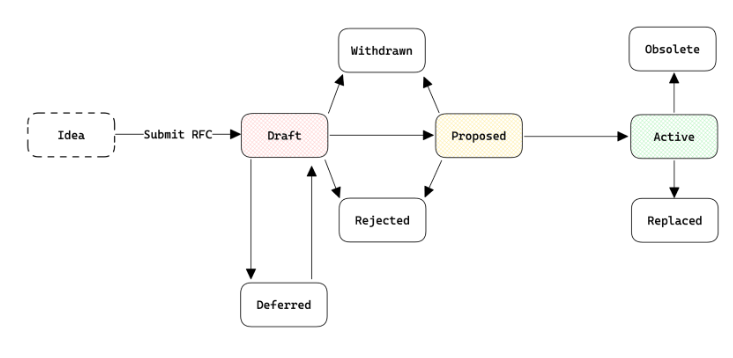

# RFC-0001 - RFC Process

## Summary

The Request for Comments (RFC) process is intended to provide a consistent and controlled path for changes to the Open Standards Development specifications and projects maintained by TBD.  The intent is for RFCs to be the primary mechanism for proposing new features, changing governance processes, and documenting design decisions.

Each major decision starts as an RFC.  Everyone is invited to discuss the proposal and work towards a shared understanding of the tradeoffs.  After consensus-building among stakeholders for the RFC, the final decision to accept or reject an RFC is made by the Technical Steering Committee (TSC).  The responsibility of the TSC is to weigh the tradeoffs and to make a decision in light of the overall direction of the relevant specification or project.  Though sometimes arduous, this deliberation is the secret sauce for quality.

This RFC defines the RFC process itself.

## Motivation

The way TBD develops specifications and SDKs has changed over time.  In the early stages of tbDEX and Web5, development moved quickly, with features added and software published in a fast-paced, exploratory manner.  As we worked towards the 1.0 release, we solidified the feature set and shifted our focus to prioritizing security, ensuring interoperability, and making the SDKs easy to use.

As tbDEX and Web5 continue to mature and grow, it is crucial to establish a more principled and structured approach to introducing changes and new features.  The current decision-making process lacks a well-defined framework, leading to potential inconsistencies and challenges in effectively managing the development lifecycle.  The absence of a clear process for proposing and deciding on major changes can result in a lack of transparency, limited stakeholder involvement, and potential delays in implementation.

To address these challenges, we propose the introduction of a Request for Comments (RFC) process.  The RFC process provides a consistent and controlled path for changes to the Open Standards Development specifications and projects maintained by TBD.  It ensures that major decisions are thoroughly discussed, evaluated, and decided upon in a transparent manner.

The RFC process brings several benefits, including fostering deep, productive discussion and building consensus to make well-informed decisions aligned with the overall direction and goals of the projects.  It also defines an easy-to-follow framework for contributing to the development and implementation of changes, encouraging broader participation.

The introduction of the RFC process marks a significant step forward in the maturity and governance of TBD's development efforts.  By adopting this principled approach, we can ensure the long-term quality, security, and interoperability of our projects while maintaining the agility to adapt to evolving requirements and technological advancements.

## Detailed Design

### When you need to follow this process

The RFC process is required when proposing substantial changes to the specifications, software projects, or governance processes maintained by TBD. To determine if a change is substantial, changes that meet one or more of the following criteria usually require an RFC:

* Is the change a semantic or syntactic modification to the specifications that is not a bug fix?

* Will the change remove features from the specifications or SDKs?

* Does the change impact how different parts of the system work together?

* Is the change a new addition to the core libraries or APIs?

* Will other teams have to do work if the change is adopted?

* Could this change lead to significant technical debt or dozens of engineering hours to implement?

* Is this a change that can't be easily undone?

* Does the change modify the governance processes or decision-making framework?

Not all changes need an RFC. Many changes, such as bug fixes and documentation updates, can be made and reviewed through the usual GitHub pull request process. Examples of changes that don't need an RFC include:

* Fixing bugs and addressing security issues

* Modifying documentation

* Rephrasing, reorganizing, or refactoring code that may be noticed by developers working on the SDKs but will remain invisible to SDK users

* Improvements that clearly enhance objective, measurable quality factors (e.g., clarifying ambiguous language in the specifications, optimizing SDK performance, improving error handling and debugging capabilities in the SDKs)

If you submit a pull request to add a new feature to a project repository without an RFC, it may be closed with a polite request to submit an RFC first.

### Before creating an RFC

A hastily-proposed RFC can hurt its chances of acceptance.  Low quality proposals, proposals for previously-rejected features, or those that don't fit into the roadmap, may be quickly rejected, which can be demotivating for the unprepared contributor. Laying some groundwork ahead of the RFC can make the process smoother.

Although there is no single way to prepare for submitting an RFC, it is generally a good idea to pursue feedback beforehand.  The most common preparations for writing and submitting an RFC include talking the idea over with other project developers and stakeholders and occasionally filing a “pre-RFC” issue in this repo for discussion.

As a rule of thumb, receiving encouraging feedback from affected stakeholders is a good indication that the RFC is worth pursuing.

### The RFC lifecycle

The RFC process follows a specific lifecycle from the initial idea to its eventual implementation or rejection. The lifecycle stages are as follows:

| Stage | Description |
| ----- | ----------- |
| Idea  | An idea for an improvement to a specification or project is conceived. At this stage, the idea is not yet tracked as an official RFC.  The idea should be discussed with other project developers and stakeholders to gauge its feasibility and potential impact. |
| Draft | Once the idea has gained some traction, the RFC is drafted and submitted to this repository for open discussion and feedback.  The RFC should be clearly written, explaining the motivation, detailed design, and any relevant considerations.  The draft stage allows for collaborative refinement of the proposal. |
| Proposed | When the RFC has been sufficiently discussed and refined, it is considered ready for review by the Technical Steering Committee (TSC).  The RFC is marked as "Proposed" and scheduled for discussion at the next TSC weekly meeting.  The TSC will evaluate the RFC based on its merits, alignment with project goals, and potential impact. |
| Deferred | In some cases, the RFC author(s) may not be actively working on the RFC but plans to continue in the future.  The RFC is marked as "Deferred" to indicate that it is temporarily on hold.  The author(s) should provide an update on their plans and timeline for resuming work on the RFC. |
| Withdrawn | The RFC author(s) may choose to withdraw their proposal at any stage of the process.  This could be due to changes in priorities, new information, or feedback received during the discussion phase. The RFC will be marked as "Withdrawn." |
| Rejected | If the TSC determines that the RFC does not align with the project's goals, has significant drawbacks, or lacks sufficient justification, it may be rejected.  The TSC will provide clear feedback on the reasons for rejection, and the RFC will be marked as "Rejected." |
| Active | If the TSC accepts the RFC, it will be marked as "Active."  A TSC member will be assigned as the Directly Responsible Individual (DRI) for overseeing the implementation of the RFC.  The DRI can delegate the implementation responsibilities to another individual or team. |
| Replaced | In some cases, an RFC may be superseded by a newer proposal that addresses similar or related topics.  When this happens, the older RFC will be marked as "Replaced," and a reference to the new RFC will be provided in the header. |
| Obsolete | If an RFC becomes irrelevant or outdated due to future changes or developments, it will be marked as "Obsolete."  This indicates that the RFC is no longer applicable or necessary. |

Throughout the RFC lifecycle, clear communication and collaboration are essential.  The RFC repository should be used as the central hub for discussions, updates, and decision-making related to each RFC.  By following this structured lifecycle, the RFC process ensures that proposals are thoroughly evaluated, refined, and implemented in a transparent and efficient manner.

### Submitting an RFC

Each RFC document includes a clear and detailed description of the proposed change, its motivation, design, and potential impact. A template is provided as a guide to ensure that all necessary information is included and presented in a structured manner.

To submit an RFC, authors should follow these steps:

1. Fork [this repository](https://github.com/TBD54566975/technical-steering-committee) on GitHub.

2. Copy [the RFC template `rfc.md`](../../templates/rfc.md) to `rfcs/0000-my-feature.md` (where "my-feature" is descriptive). Don't assign an RFC number yet.

3. Fill in the RFC.  Put care into the details: RFCs that do not present convincing motivation, demonstrate lack of understanding of the design's impact, or are disingenuous about the drawbacks or alternatives tend to be poorly-received.

4. Submit a pull request.

5. Each pull request will automatically be labeled as `Draft` to allow for collaborative refinement of the proposal.

6. The author should be prepared to integrate feedback and build consensus. RFCs that have broad support are much more likely to make progress than those that don't receive any comments.

7. RFCs rarely go through this process unchanged, especially as alternatives and drawbacks are shown.  You can make edits, big and small, to the RFC to clarify or change the design, but make changes as new commits to the pull request, and leave a comment on the pull request explaining your changes.  Specifically, do not squash or rebase commits after they are visible on the pull request.

8. When the RFC has been sufficiently discussed and refined, it is considered ready for review by the Technical Steering Committee (TSC).  The author should label the RFC as `Proposed` so that it will be scheduled for discussion at the next TSC weekly meeting.

### Decision making

Once the RFC is labeled as `Proposed`, the following will happen at the next TSC weekly meeting:

1. An author of the RFC is expected to be present and becomes the RFC DRI

2. The `Proposed at` timestamp is set to the meeting date

3. 10 minutes of silent reading

4. 10 minutes of Q&A with a focus on understanding what is being proposed, not to provide feedback

5. After the meeting, TSC members review the RFC in further detail, discuss with impacted stakeholders, and post feedback to the RFC pull request

6. TSC members are expected to respond within 7 days (or less) to either:

   * Provide blocking feedback
   
   * Accept the proposal (with or without feedback)

7. The RFC DRI is expected to address feedback by either changing the RFC or by explaining.

8. At the next TSC weekly meeting, members review the feedback and:

   * For Type 1 decision making: If there is no blocking feedback, the RFC is accepted

   * For Type 2 decision making: If all TSC members accept, the RFC is accepted

   * If the TSC reaches an impasse, the TSC lead will make the decision

### After the decision

If the RFC is not accepted, the author(s) can propose it again after addressing blocking feedback.

Accepted RFCs will be marked as "Active" and a TSC member will be assigned as the Directly Responsible Individual (DRI) for overseeing the implementation of the RFC.  The DRI can delegate the implementation responsibilities to another individual or team. The RFC DRI will work with TBD Engineering Leads to prioritize and staff the implementation.

Every accepted RFC has an associated issue tracking its implementation in its respective repository; thus that associated issue can be assigned a priority via the triage process that the TBD Engineering team uses.  Community members who are interested in working on the implementation for an "active" RFC can volunteer by leaving a comment on the associated issue.

### Maintaining RFCs

In some cases, an RFC may be superseded by a newer proposal that addresses similar or related topics.  An RFC author or TSC member can propose that an existing RFC be replaced during the review of a “`Proposed`“ RFC.  If the proposed RFC is accepted, the older RFC will be marked as "`Replaced`," and a reference to the new RFC will be provided in the header.

If an RFC becomes irrelevant or outdated due to future changes or developments, an issue should be opened in the RFC repo proposing the change.  TSC members will review the proposal and if all members accept, the RFC will be marked as "`Obsolete`."  This indicates that the RFC is no longer applicable or necessary.

### References

Include any relevant references or links to additional resources related to the RFC process or the specific RFC being proposed.
By including these sections, you provide a comprehensive overview of the RFC process, making it clear to all stakeholders how to participate, what to expect, and how decisions are made. It helps ensure transparency, consistency, and effective collaboration within your software engineering team.

## Drawbacks

While the proposed RFC process aims to improve the decision-making and development lifecycle, it may introduce some additional overhead and complexity. The process requires more upfront work from contributors in terms of writing detailed proposals and engaging in discussions.  This may potentially slow down the pace of development, especially for smaller changes.  Additionally, the formal nature of the process might be perceived as bureaucratic and could discourage some contributors from proposing changes.  

It's important to strike a balance between ensuring thorough evaluation and maintaining agility.  The proposed process is intended to be as lightweight as reasonable for the present circumstances.

## Alternatives

### Retain the current informal approach

The newly proposed RFC process is designed to improve over the informal process in the following ways:

* **Increased transparency**: By using a structured and documented process, all stakeholders have visibility into the decision-making process and can contribute their perspectives. This transparency helps build trust and ensures that all voices are heard.

* **Improved collaboration**: The RFC process encourages active collaboration and discussion among stakeholders. By fostering open communication and feedback, the process helps refine ideas and build consensus around proposed changes.

* **Enhanced decision-making**: The RFC process provides a clear framework for evaluating proposals based on their merits, alignment with project goals, and potential impact. This structured approach helps the TSC make well-informed decisions that benefit the project as a whole.

* **Clear accountability**: With the assignment of a Directly Responsible Individual (DRI) for each accepted RFC, there is clear ownership and accountability for the implementation of approved changes. This ensures that accepted proposals are properly executed and followed through.

* **Maintained agility**: While the RFC process introduces some structure and formality, it is designed to maintain agility in the development process. The process allows for quick iteration and refinement of proposals through collaborative discussions and feedback.

While the current informal approach may be more familiar and require less upfront effort, it lacks the benefits of a structured process in terms of transparency, collaboration, decision-making, and accountability. The RFC process strikes a balance between providing a clear framework for proposing and evaluating changes while still allowing for flexibility and agility in the development lifecycle.

### Specify different types of RFCs

As an alternative, we could adopt a categorization similar to [Python's PEP Types](https://legacy.python.org/dev/peps/pep-0001/#pep-types), which specifies three kinds of RFCs:

1. A **Standards Track** RFC describes a new feature or implementation for the specifications or SDKs maintained by TBD. It may also describe an interoperability standard that will be supported outside the core libraries for current versions before a subsequent RFC adds core library support in a future version.

2. An **Informational** RFC describes a design issue or provides general guidelines or information to the TBD community but does not propose a new feature.

3. A **Process** RFC describes a process surrounding the development and maintenance of specifications and SDKs, or proposes a change to (or an event in) a process. Process RFCs are like Standards Track RFCs but apply to areas other than the specifications or SDKs themselves. They may propose an implementation, but not to the codebase. Examples include procedures, guidelines, and changes to the decision-making process.

By adopting this categorization, the RFC process can differentiate between proposals that introduce new features or implementations (Standards Track), those that provide general information or guidelines (Informational), and those that propose changes to processes or procedures (Process). This distinction can help set expectations and guide the review and decision-making process for each type of RFC.

## Prior art

* [Rust RFC Process](https://github.com/rust-lang/rfcs), including [RFC-0002](https://github.com/rust-lang/rfcs/blob/master/text/0002-rfc-process.md), [RFC-1068](https://github.com/rust-lang/rfcs/blob/HEAD/text/1068-rust-governance.md)

* [PEP-0001](https://legacy.python.org/dev/peps/pep-0001/), Python PEP Purpose and Guidelines

* [RFC 7322](https://www.rfc-editor.org/rfc/rfc7322.html), IETF RFC Style Guide

* [BIP-1](https://github.com/bitcoin/bips/blob/master/bip-0001.mediawiki) and [BIP-2](https://github.com/bitcoin/bips/blob/master/bip-0002.mediawiki), Bitcoin Improvement Proposal Purpose and Guidelines

* [SIP-1](https://github.com/TBD54566975/ssi-service/blob/main/doc/sip/sips/sip1/README.md), SSI Improvement Proposal Purpose and Guidelines

## Unresolved questions

* Does this RFC Process strike a favorable balance between formality and agility?

* Does this RFC Process successfully address the aforementioned issues with the current informal approach to changing TBD maintained specifications and projects?

* Should we retain rejected RFCs in the archive?
